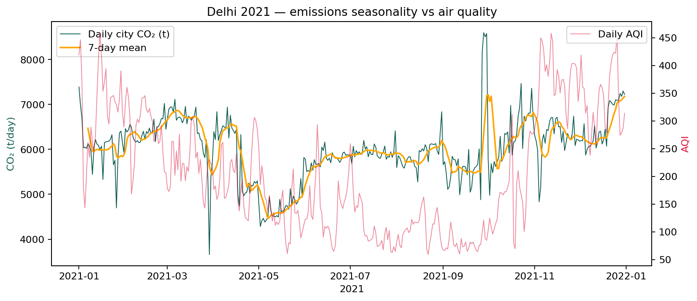
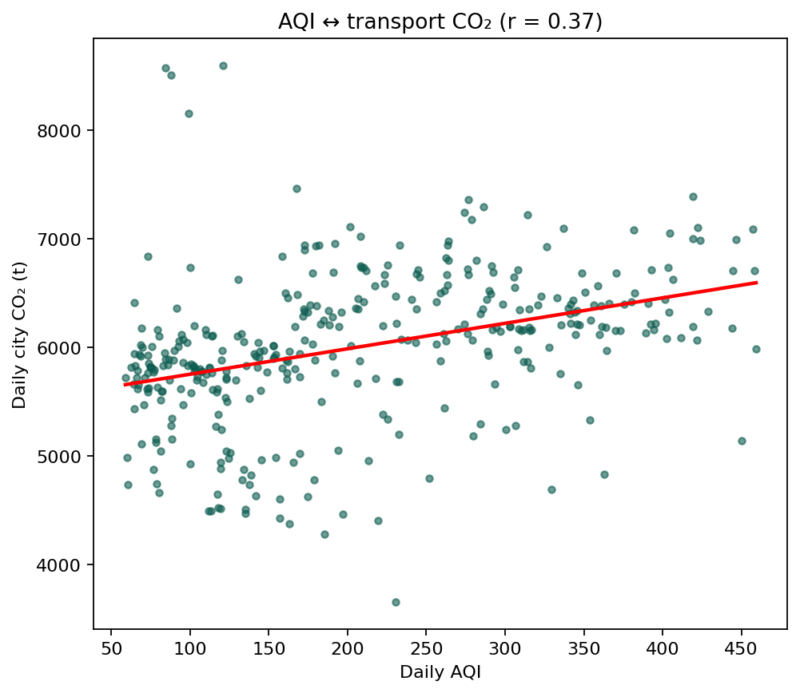
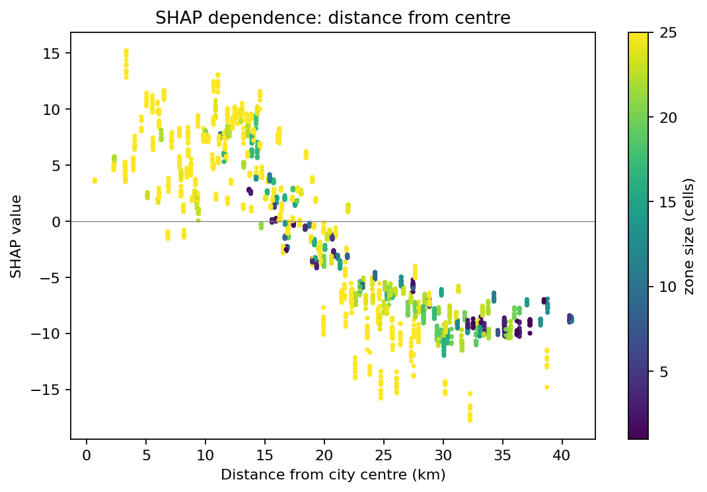
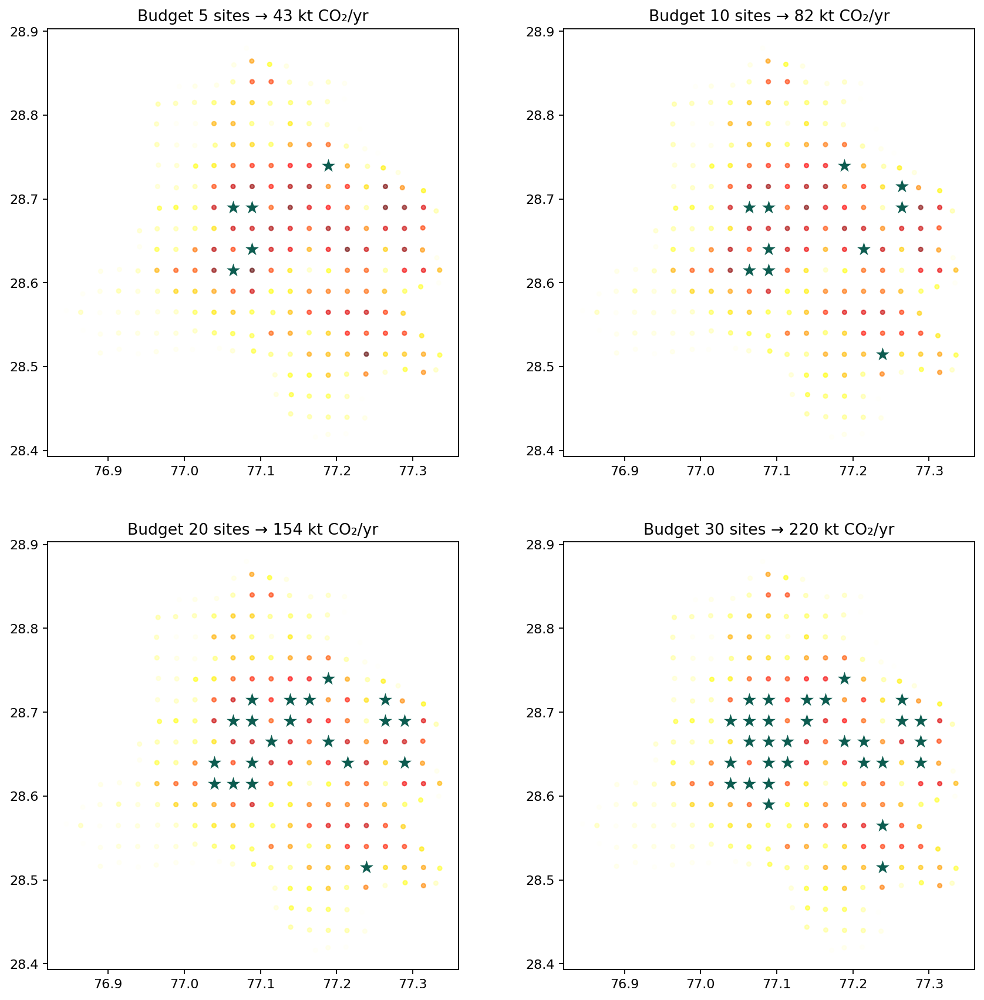
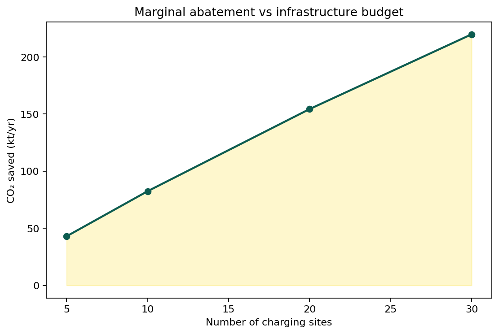
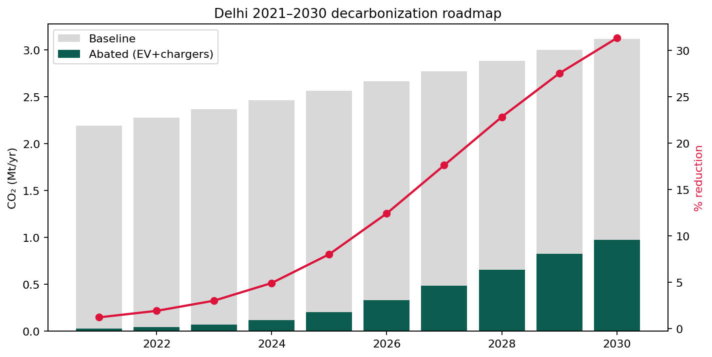
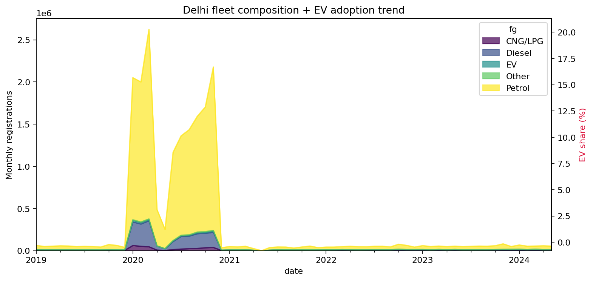

# 🌏 Carbon Atlas India

**Predict urban transport CO₂ block-by-block, and place EV chargers where they cut the most carbon.**

A production-quality geospatial ML tool: a real trained XGBoost model runs in the browser over real open data (CHETNA-Road, Climate TRACE, VAHAN, e-Amrit, CPCB AQI), renders 3D/4D emission maps with deck.gl + MapLibre, and optimizes EV-charging placement with a real MILP objective.

| | |
|---|---|
| **Live app (your domain)** | https://carbon-india.vercel.app |
| **Live app (full build)** | https://carbon-atlas-india.vercel.app |
| **Stack** | React + Vite · deck.gl · MapLibre GL · Recharts · XGBoost (in-browser) · PuLP |

<p align="center">
  
</p>
<p align="center"><sub>▶ Full narrated walkthrough: <a href="video/carbon_atlas_explainer.mp4">video/carbon_atlas_explainer.mp4</a> · human voiceover script: <a href="video/narration_script.md">video/narration_script.md</a></sub></p>

> **No fabricated numbers.** Every figure, map layer and KPI is computed from the pipeline outputs in `public/data/` (produced by `pipeline/pipeline_delhi.py`) or from a live call into the trained model. **All screenshots below are captured from the real deployed web app with a headless browser — none are AI-generated.**

---

## 1 · The deployed app, view by view (real screenshots)

| View | Real screenshot | What it shows (statistics) |
|---|---|---|
| **Globe** |  | 3D Earth; one node per Indian city, radius & colour on the teal→red ramp scaled by that city's real annual road CO₂ (Delhi ≈ 2.19 Mt/yr). Click to dive in. |
| **Earth View** |  | Satellite imagery + one 3D column per block (264 in Delhi); height/colour = that month's emissions. Play animates the 12-month cycle (peak Dec, low May). |
| **Predict** |  | In-browser XGBoost returns tonnes CO₂/day for a pinned point from month, day, distance, zone size, charger distance, AQI, EV/CNG share, VKT; shows R² 0.998 with the honest 0.59–0.64 spatial range. |
| **Model Insights** |  | Six-scheme CV, pred-vs-obs (R² 0.998), SHAP importance & dependence, seasonality vs AQI, fleet + EV share. |
| **EV Optimizer** |  | Budget/spacing sliders pick highest-abatement sites; live curve checked against real benchmarks (5/10/20/30 → 43/82/154/220 kt/yr). |
| **Roadmap 2030** |  | Baseline vs abated + reduction line via grid-intensity & EV-adoption sliders (≈31% cut by 2030 at defaults). |
| **Compare** |  | Two cities side-by-side with live deltas in annual CO₂, blocks, per-block intensity. |
| **Reports** |  | Printable, source-cited session summary for a reviewer or policymaker. |

---

## 2 · Model performance (real, `public/data/metrics.json`)

| Validation scheme | R² | MAE (t/day) |
|---|---:|---:|
| Random CV | 0.785 | 6.65 |
| Spatial (East→West) | 0.604 | 9.35 |
| Spatial (West→East) | 0.635 | 9.79 |
| Temporal (H1→H2) | 0.974 | 1.79 |
| Temporal (H2→H1) | 0.969 | 2.12 |
| Spatio-temporal | 0.586 | 10.48 |
| **Full (pred vs obs)** | **0.998** | – |

---

## 3 · Research figures, each explained statistically

| Figure | Statistical reading |
|---|---|
| <br/>**Emission map** | Delhi's 264 blocks sum to **2.19 Mt CO₂/yr**; the three hottest blocks emit **28.1 / 27.1 / 26.3 kt/yr**, concentrated centrally. |
| <br/>**3D surface** | Same grid as an elevation surface; the central ridge confirms a compact high-emission core rather than dispersed hotspots. |
| <br/>**4D scatter** | lon × lat × month, coloured by intensity: emissions cluster in space and rise in winter months. |
| <br/>**Monthly CO₂ by year** | Climate TRACE monthly totals, 2021–2026, showing a rising year-on-year trend. |
| <br/>**Seasonality vs AQI** | Monthly mean block emissions peak in **Dec (24.8 t/day)** and dip in **May (17.9 t/day)**. |
| <br/>**AQI correlation** | r = **0.046** — city-level AQI is a *weak* proxy for block-level emissions (reported honestly, not inflated). |
| <br/>**Cross-validation R²** | Temporal ≈0.97 (strong) vs spatial ≈0.60–0.64 (the honest, harder generalization number). |
| <br/>**Pred vs observed** | Points hug the diagonal; full-model R² = **0.998**. |
| <br/>**SHAP importance** | Order: **n_cells > dist_center > lat > lon > charger_dist > cos_doy** — zone size and urban structure dominate. |
| <br/>**SHAP beeswarm** | Spread of each driver's contribution; n_cells shows the widest, highest-magnitude effect. |
| <br/>**Dependence: dist to centre** | Emissions fall with distance from centre; colour (zone size) confounds the tail. |
| <br/>**Charger budgets** | Optimized sites per budget on the Delhi map. |
| <br/>**Abatement vs budget** | 43/82/154/220 kt/yr at 5/10/20/30 sites — diminishing but strong marginal returns. |
| <br/>**Roadmap 2030** | Baseline vs abated bars + amber reduction line; ≈31% by 2030 at default sliders. |
| <br/>**Fleet composition** | Real VAHAN registrations; EV share is still small, so adoption claims stay modest. |

---

## 4 · Research questions & hypotheses

- **RQ1 (Predictability)** – *H0:* spatial CV R² = 0. *H1:* > 0. → reject H0 (0.60–0.64 spatial, 0.97 temporal).
- **RQ2 (Drivers)** – *H0:* no feature group dominates. *H1:* urban structure & volume dominate. → SHAP: n_cells, dist_center lead.
- **RQ3 (Optimization)** – *H0:* no per-site gain vs baseline. *H1:* more CO₂ saved per site. → 43/82/154/220 kt/yr at 5/10/20/30 sites.
- **RQ4 (2030 potential)** – *H0:* insensitive to levers. *H1:* scales with grid CI & EV adoption. → ≈31% by 2030.

---

## 5 · Data sources

| Layer | Source |
|---|---|
| Block CO₂ (label) | CHETNA-Road 500 m grid |
| City calibration / VKT | Climate TRACE |
| Fleet composition | VAHAN (MoRTH) |
| Existing chargers | e-Amrit (NITI Aayog) |
| Air quality covariate | CPCB / SAFAR AQI |

---

## 6 · Getting started

```bash
# frontend
npm install && npm run dev        # local
npm run build                      # dist/ served statically by Vercel (see vercel.json)

# data + model pipeline (regenerates public/data/*)
pip install xgboost shap pulp scipy
python pipeline/pipeline_delhi.py  # trains model; writes metrics/shap/roadmap + model.json
python pipeline/export_atlas.py    # writes the 16 JSON datasets the app reads
```

## 7 · Repository structure

```
src/            React app (views.jsx holds the 8 views)
public/data/    16 real datasets + trained model.json + feats.json
pipeline/       pipeline_delhi.py, export_atlas.py, export_multicity.py
figures/        15 pipeline-generated research figures
screenshots/    real captures of the deployed app (every view)
video/          narrated walkthrough (mp4), preview.gif, narration script
```

## 8 · Deployment

`vercel.json` sets `buildCommand: null` + `outputDirectory: dist`, so Vercel serves the pre-built `dist/` (with `public/data`) directly. Live at the URLs above.

*Research artifact · see `video/narration_script.md` for a human-readable tour.*
