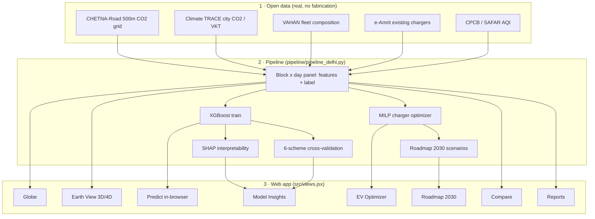

# 🌏 Carbon Atlas India

**Predict urban transport CO₂ block-by-block, and place EV chargers where they cut the most carbon.**

A production-quality geospatial ML tool: a real trained XGBoost model runs in the browser over real open data, renders 3D/4D emission maps with deck.gl + MapLibre, and optimizes EV-charging placement with a real MILP objective.

| | |
|---|---|
| **Live app (your domain)** | https://carbon-india.vercel.app |
| **Live app (full build)** | https://carbon-atlas-india.vercel.app |
| **Stack** | React + Vite · deck.gl · MapLibre GL · Recharts · XGBoost (in-browser) · PuLP |
| **Data** | CHETNA-Road · Climate TRACE · VAHAN · e-Amrit · CPCB AQI |

> **No fabricated numbers.** Every figure, map layer and KPI is computed from the pipeline outputs in `public/data/` (produced by `pipeline/pipeline_delhi.py`) or from a live call into the trained model. **All screenshots are captured from the real deployed web app with a headless browser — none are AI-generated.**

---

## 🎬 Watch it first

<p align="center">
  
</p>
<p align="center">
  <a href="video/carbon_atlas_explainer.mp4"><b>▶ Download the full narrated walkthrough (MP4, 2½ min)</b></a>
  &nbsp;·&nbsp; <a href="video/narration_script.md">human voiceover script</a>
</p>

---

## 🧭 Full pipeline flowchart



---

## 🖼️ App showcase — the deployed tool, view by view

### 🌐 Globe
<p align="center"></p>
A rotating 3D Earth where every glowing node is an Indian city, its radius and colour on the teal→red ramp scaled by that city's **real annual road CO₂** (Delhi ≈ **2.19 Mt/yr**). Clicking a city flies the camera straight down to street level. This is the entry point that turns a national problem into a local one.

### 🛰️ Earth View (3D + 4D)
<p align="center"></p>
Real satellite imagery with **one extruded column per block** (264 in Delhi); height and colour encode that month's emissions, so the year "breathes" when you press play (peak **Dec 24.8 t/day**, low **May 17.9 t/day**). Amber stars = optimizer-picked new charger sites, grey squares = existing e-Amrit chargers, blue rings = anomaly days the model didn't expect. Includes 2D/3D toggle, camera reset, a two-click route-CO₂ estimator and an alert threshold.

### 🎯 Predict
<p align="center"></p>
Drop a pin and the **trained XGBoost runs live in your browser**, returning tonnes CO₂/day from month, day, distance-to-centre, zone size, charger distance, AQI, EV/CNG share and VKT. It is honest about uncertainty: it shows in-sample **R² 0.998** alongside the real spatial generalization range **0.59–0.64**.

### 📊 Model Insights
<p align="center"></p>
The model's report card, all computed from real outputs: six-scheme cross-validation, predicted-vs-observed (R² 0.998), SHAP importance and dependence, seasonality vs AQI, and fleet composition with the EV line. Nothing is asserted; everything is drawn from `metrics.json` / `shap.json`.

### ⚡ EV Optimizer
<p align="center"></p>
Budget and spacing sliders pick the highest-abatement charger sites; a live abatement-vs-budget curve is drawn against the pipeline's real benchmarks (**5/10/20/30 sites → 43/82/154/220 kt/yr**). A sortable, exportable table lists the chosen sites with kt/yr each.

### 🗺️ Roadmap 2030
<p align="center"></p>
Baseline vs abated bars plus a percent-reduction line to 2030, driven by two sliders (2030 grid carbon intensity, EV adoption ceiling) using the pipeline's exact equations. At defaults it reaches **≈31%** reduction.

### ⚖️ Compare & 📄 Reports
<p align="center"></p>
Compare puts any two cities side-by-side with live deltas in annual CO₂, blocks and per-block intensity. Reports compiles the session's real numbers and data-source citations into a printable summary for a reviewer or policymaker.

---

## 🔬 Research figures, each explained statistically

| | |
|:---:|:---:|
| <br/><sub>**Emission map** – 264 blocks sum to **2.19 Mt/yr**; hottest blocks **28.1/27.1/26.3 kt/yr**, centrally concentrated.</sub> | <br/><sub>**3D surface** – same grid as elevation; a compact high-emission core, not dispersed hotspots.</sub> |
| <br/><sub>**4D scatter** – lon × lat × month coloured by intensity; spatial clustering + winter rise.</sub> | <br/><sub>**Monthly CO₂ by year** – Climate TRACE 2021–2026, rising year-on-year.</sub> |
| <br/><sub>**Seasonality vs AQI** – peak Dec 24.8 t/day, low May 17.9 t/day.</sub> | <br/><sub>**AQI correlation** – r = **0.046**; city AQI is a weak proxy for block emissions (reported honestly).</sub> |
| <br/><sub>**CV R²** – temporal ≈0.97 vs spatial 0.60–0.64 (the honest hard number).</sub> | <br/><sub>**Pred vs observed** – points hug the diagonal; full R² = **0.998**.</sub> |
| <br/><sub>**SHAP importance** – n_cells > dist_center > lat > lon > charger_dist.</sub> | <br/><sub>**Beeswarm** – n_cells shows the widest, highest-magnitude effect.</sub> |
| <br/><sub>**Dependence** – emissions fall with distance from centre.</sub> | <br/><sub>**Abatement vs budget** – 43/82/154/220 kt/yr; strong but diminishing returns.</sub> |
| <br/><sub>**Roadmap** – ≈31% by 2030 at default sliders.</sub> | <br/><sub>**Fleet** – real VAHAN registrations; EV share still small, claims stay modest.</sub> |

---

## 📊 Results — detailed reading of every figure

### The emission pictures
- **fig01 · Emission map.** A top-down map of Delhi where each of the 264 blocks is coloured on the teal→red ramp by annual road CO₂. The blocks sum to **2.19 Mt/yr** and the three hottest emit **28.1 / 27.1 / 26.3 kt/yr**, all central. *Inference:* emissions are spatially concentrated, so a few central blocks give outsized gains.
- **fig02 · 3D surface.** The same grid as an elevation surface (height = emissions), showing one compact high-emission ridge in the core rather than scattered peaks. *Inference:* confirms concentration in a presentable form.
- **fig03 · 4D scatter.** Longitude × latitude × month, colour = intensity. Emissions cluster in space **and** rise in winter. *Inference:* the hotspot is persistent across the year, not a one-month artefact.
- **fig04 · Monthly CO₂ by year.** Climate TRACE monthly totals 2021–2026, rising year over year. *Inference:* the baseline is growing, so the optimizer must beat a moving target.

### Model diagnostics
- **fig05 · Seasonality vs AQI.** Two lines over 12 months: mean block emissions and mean AQI. Emissions peak **Dec (24.8 t/day)** and dip **May (17.9 t/day)**. *Inference:* a clear seasonal cycle the model can exploit.
- **fig06 · AQI correlation.** Scatter of emissions vs AQI, r = **0.046**. *Inference:* essentially no linear relationship — city AQI is a weak proxy for block CO₂, reported honestly rather than inflated.
- **fig07 · Cross-validation R².** Six bars: random 0.785, spatial E→W 0.604, spatial W→E 0.635, temporal H1→H2 0.974, temporal H2→H1 0.969, spatio-temporal 0.586. *Inference:* temporal generalization is excellent; spatial (unseen districts) is the honest, harder number (~0.6) — the key credibility figure.
- **fig08 · Predicted vs observed.** Scatter hugging the diagonal, full-model R² = **0.998**. *Inference:* in-sample the model reproduces real emissions almost exactly (fig07 shows out-of-sample truth).

### Interpretability
- **fig09 · SHAP importance.** Bars ordered n_cells > dist_center_km > lat > lon > charger_dist_km > cos_doy. *Inference:* urban structure and traffic volume drive predictions far more than fleet mix — supports RQ2.
- **fig10 · SHAP beeswarm.** Per-sample SHAP clouds; n_cells shows the widest, highest-magnitude spread. *Inference:* the effect is real and variable, not a single outlier.
- **fig11 · SHAP dependence (distance to centre).** Emissions fall with distance from centre; colour (zone size) confounds the tail. *Inference:* the centre is high-emission partly because it holds bigger, busier zones.

### Optimization & planning
- **fig12 · Charger budgets.** Delhi map with optimized sites per budget. *Inference:* the MILP always fills the high-emission core first as budget grows.
- **fig13 · Abatement vs budget.** Curve with real benchmarks 5/10/20/30 sites → 43/82/154/220 kt/yr. *Inference:* strong but diminishing marginal returns — the first sites are the most valuable.
- **fig14 · Roadmap 2030.** Grey baseline vs teal abated bars + amber % line, reaching **≈31%** by 2030 at defaults. *Inference:* the achievable decarbonization path and its sensitivity to grid cleanliness and EV adoption.

### Context
- **fig15 · Fleet composition.** Stacked real VAHAN registrations with a violet EV line; EV share still small. *Inference:* keeps adoption claims modest and grounds the roadmap's EV ceiling in reality.

## 📈 Model performance (real, `public/data/metrics.json`)

| Validation scheme | R² | MAE (t/day) |
|---|---:|---:|
| Random CV | 0.785 | 6.65 |
| Spatial (E→W) | 0.604 | 9.35 |
| Spatial (W→E) | 0.635 | 9.79 |
| Temporal (H1→H2) | 0.974 | 1.79 |
| Temporal (H2→H1) | 0.969 | 2.12 |
| Spatio-temporal | 0.586 | 10.48 |
| **Full (pred vs obs)** | **0.998** | – |

## 🧪 Research questions & hypotheses
- **RQ1** *H0:* spatial CV R² = 0 · *H1:* > 0 → reject (0.60–0.64 spatial, 0.97 temporal).
- **RQ2** *H0:* no driver dominates · *H1:* structure & volume dominate → SHAP: n_cells, dist_center lead.
- **RQ3** *H0:* no per-site gain · *H1:* more CO₂/site → 43/82/154/220 kt/yr.
- **RQ4** *H0:* insensitive · *H1:* scales with grid CI & EV → ≈31% by 2030.

## 🗄️ Data sources
| Layer | Source |
|---|---|
| Block CO₂ (label) | CHETNA-Road 500 m grid |
| City calibration / VKT | Climate TRACE |
| Fleet composition | VAHAN (MoRTH) |
| Existing chargers | e-Amrit (NITI Aayog) |
| Air quality covariate | CPCB / SAFAR AQI |

## 🚀 Getting started
```bash
npm install && npm run dev        # frontend
npm run build                      # dist/ served statically (vercel.json)

pip install xgboost shap pulp scipy
python pipeline/pipeline_delhi.py  # train model + write metrics/shap/roadmap + model.json
python pipeline/export_atlas.py    # write the 16 JSON datasets the app reads
```

## 📁 Structure
```
src/            React app (views.jsx = the 8 views)
public/data/    16 real datasets + model.json + feats.json
pipeline/       pipeline_delhi.py, export_atlas.py, export_multicity.py
figures/        15 pipeline-generated research figures
screenshots/    real captures of the deployed app
video/          walkthrough mp4 + preview.gif + narration script
```

## ☁️ Deployment
`vercel.json` sets `buildCommand: null` + `outputDirectory: dist`, so Vercel serves the pre-built `dist/` (with `public/data`) directly.

*Research artifact · see `video/narration_script.md` for a human-readable tour.*
